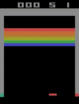

## Deep Q-network

### Introduction

An extensible `tensorflow`/`gym` based implementation of the deep Q-network with experience replay as presented in [Human-level control through deep reinforcement learning](http://www.nature.com/nature/journal/v518/n7540/full/nature14236.html).

### Results

The result of training for 6m time steps using a Tesla K80 GPU:

 

 

### TODO

- Investigate the effect of loss clipping on learning rate
- Implement contiguous memory buffer to speed up experience replay
- Implement [asynchronous deep Q-learning](https://arxiv.org/abs/1602.01783) to eliminate replay buffer
